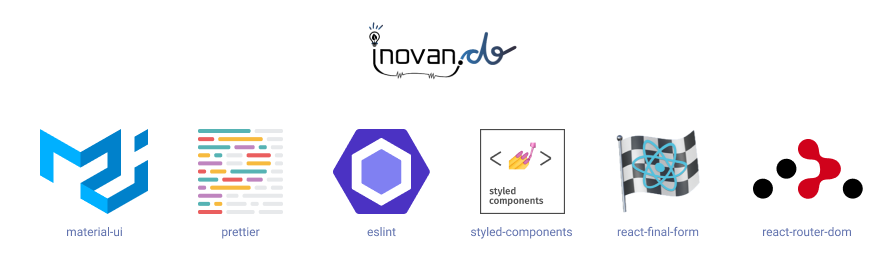
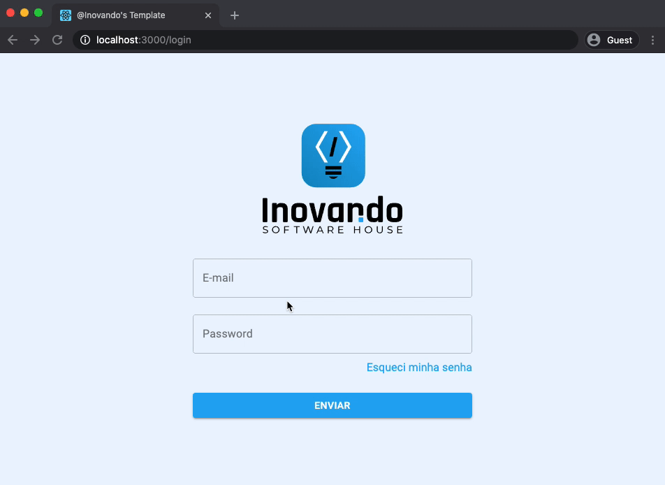
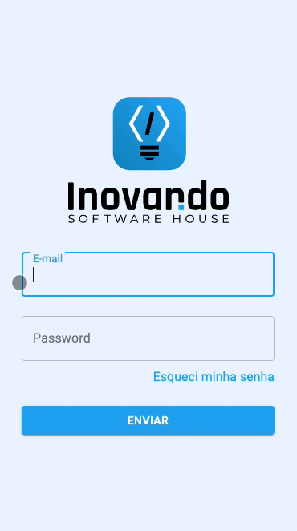

# `@inovando/cra-template`
> ⚡️ Inovando's template for create-react-app

[](https://www.npmjs.com/package/@inovando/cra-template)
[](https://github.com/prettier/prettier)



## Preview

|   Desktop   |  Mobile  |
|---------|-----------|
|  |  |


## Usage

1. Initialize your project with this command:

```
npx create-react-app my-app --template @inovando
```

2. Duplicate `.env.example` to `.env.development.local` and `.env.production` fulfilling variables as needed

3. Done 🎉

## Scripts

### `yarn serve`

Serve app based on `build/` folder (generated by `yarn build`)

### `yarn build-and-serve`

Build and serve `build/` folder

## Features
- [x] [ESLint](https://github.com/santospatrick/eslint-config-react)/[Prettier](https://github.com/santospatrick/prettier-config)
- [x] [Axios](https://www.npmjs.com/package/axios)
- [x] [Styled Components](https://styled-components.com/)
- [x] [React Final Form](https://final-form.org/react)
- [x] [Yup](https://runkit.com/jquense/yup)
- [x] [Husky](https://github.com/typicode/husky)/[Lint Staged](https://github.com/okonet/lint-staged)
- [x] [Material UI](https://material-ui.com/)
- [x] [React Router](https://reacttraining.com/react-router/web/guides/quick-start)
- [ ] [React Toastify](https://github.com/fkhadra/react-toastify)

## FAQ

### Why ESLint and plugins are dependencies?

Until the release date of this package, create react app [does not support devDependencies](https://github.com/facebook/create-react-app/issues/8082) field at `template.json`

### Git hooks not working

```
rm -rf node_modules && yarn
```
